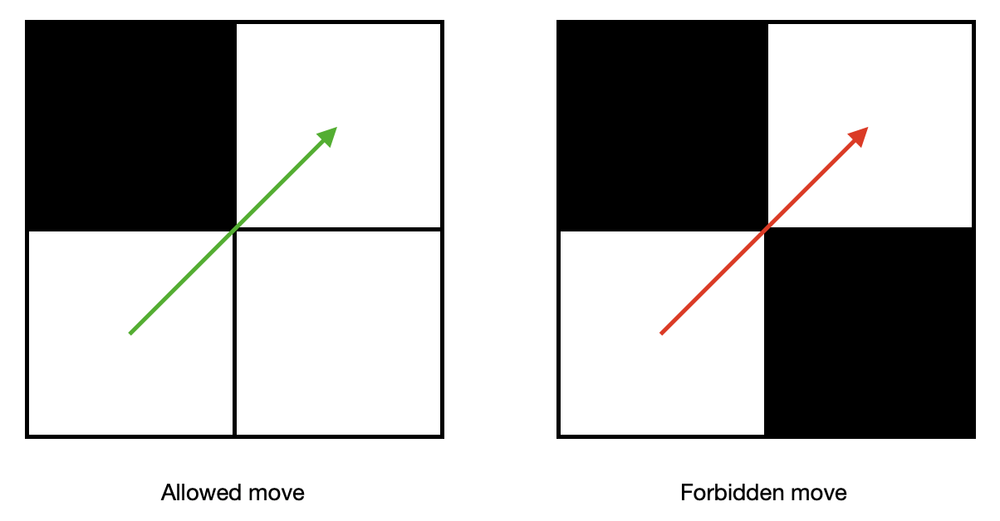
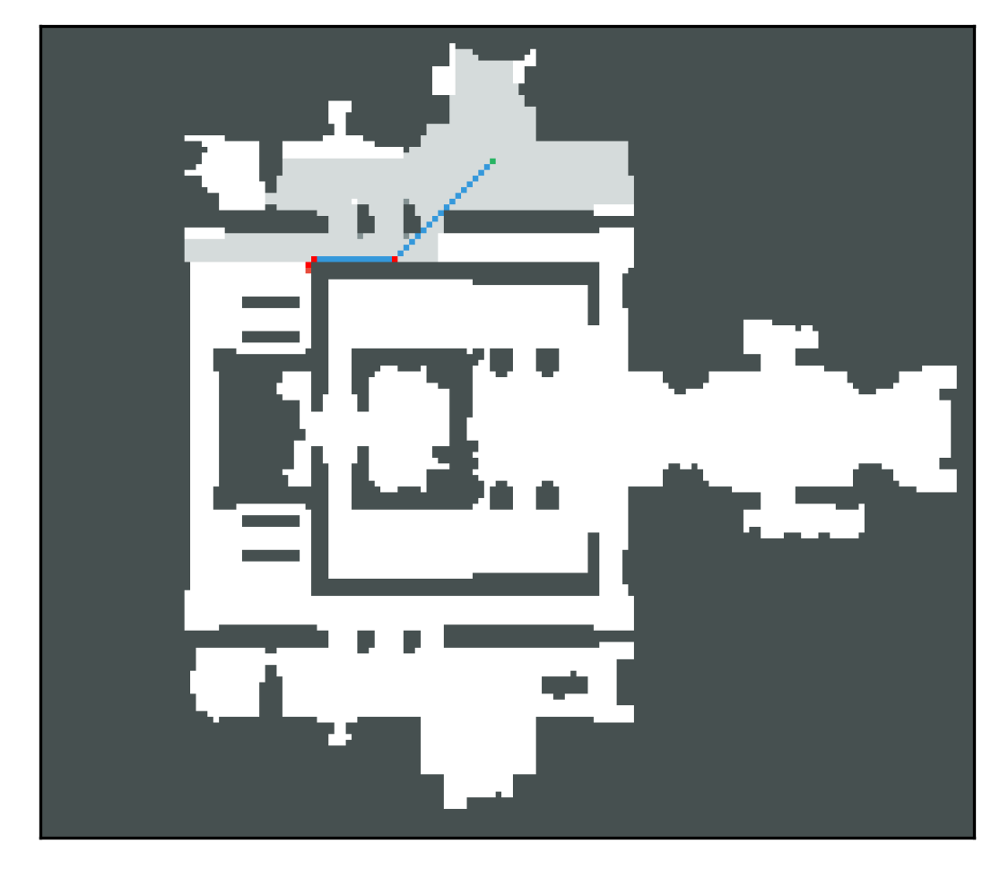
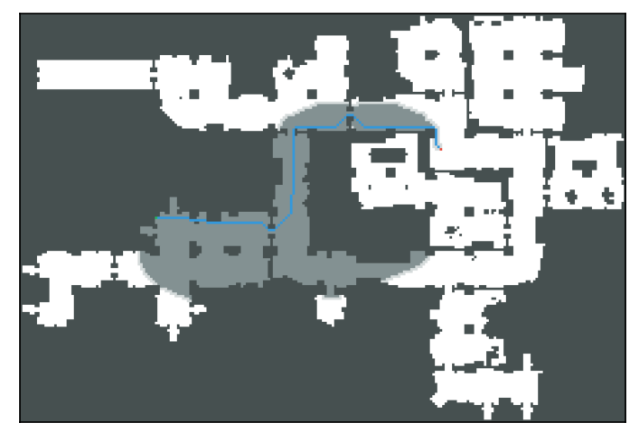
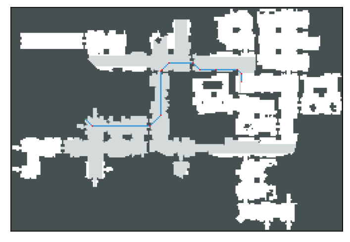
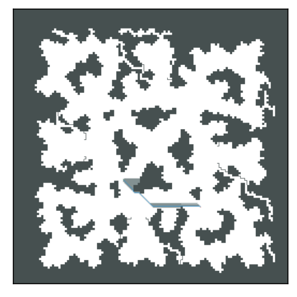
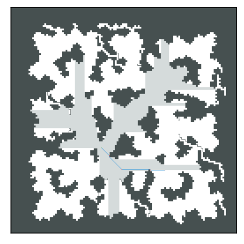

# PathPlanningAlgorithms JPS (JumpPoint Search)

## Description

In the file `JPS_upg.ipynb` implements two heuristic search algorithms for 8-connected uniform-cost greed:
- A* in which it is allowed to cut corners (see figure), with a diagonal heuristic
- JPS with a diagonal heuristic, where it is also assumed that the agent can cut corners.



This project uses

- Jupyter python notebook

## Installing

Download current repository to your local machine. Use

```bash
git clone https://github.com/Classman-wand/JPS/
```

The project requires python modules:

- PIL
- numpy
- matplotlib
- math
- heapq
- queue

To install them use bash command

```bash
pip install module
```
or insert into ipynb cell
```
!pip install module
```
## Input and output

### Input file

- Input files of our algorithm: two files with extensions `.map` and `.map.scen` in the [movingai](https://movingai.com/benchmarks/formats.html) format.


You can see an example of input data in the folder `maps`. [Sample map](./maps/lt_house.map), [Sample task](./maps/lt_house.map.scen). In case of incorrect data, there may be undefined behavior.

### Output

At the output of the work, you get for each of the following algorithms:
- The path found
- Path length
- Array of expanded nodes
- Array of visited nodes
- And you can also visualize it all with the function `Draw` for A*, and `Draw_JPS` for JPS.


## Examples of work

Below is a visualization of the algorithms on three different maps.
- Dark gray - obstacles
- Gray - cells expanded by the algorithm
- Light gray - cells visited by the algorithm
- Green - start cell
- Pale red - finish cell
- Blue - is the path found by the algorithm
- Red - jump points along the path for the JPS algorithm

### 1. Map ht_chantry

- Algorithm: A*


- Algorithm: JPS


### 2. Map ht_store

- Algorithm: A*


- Algorithm: JPS


### 3. Map lt_house

- Algorithm: A*


- Algorithm: JPS


### 4. Map den011d

- Algorithm: A*


- Algorithm: JPS


### 5. Map duskwood

- Algorithm: A*


- Algorithm: JPS



## Sources

- Daniel Harabor, Alban Grastien, [Online Graph Pruning for Pathfinding on Grid Maps](https://www.google.com/url?sa=t&rct=j&q=&esrc=s&source=web&cd=&ved=2ahUKEwij6YPcy_n0AhXksIsKHQLvCl4QFnoECAgQAQ&url=https%3A%2F%2Fwww.aaai.org%2Focs%2Findex.php%2FAAAI%2FAAAI11%2Fpaper%2Fdownload%2F3761%2F4007&usg=AOvVaw3sWq3vcrlKtPCuZeefIdd-). NICTA and The Australian National University
- Nathan Sturtevant, [Moving AI Lab](https://movingai.com)
- Yakovlev Konstantin, Course on Methods and Algorithms for Heuristic Search. St. Petersburg State University
